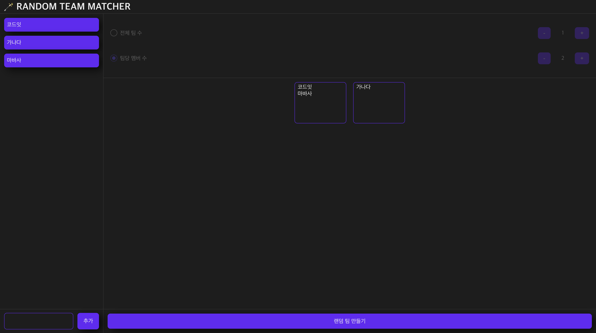

# RANDOM TEAM MATCHER

랜덤으로 팀을 매칭해주는 사이트입니다. 이름을 입력하고 "MAKE TEAM" 버튼을 누르면 팀이 랜덤으로 생성됩니다.



## 기능 스펙

- 멤버 추가하기
- 팀 랜덤으로 생성해주기

## Prerequisite

- VSCode Extension 설치
  - eslint
  - prettier

## Setup Project (팀당 1명이 담당, 팀장)

1. Use This Template 클릭
1. Repository 설정
1. Settings > Collaborators 설정
1. Branch Protection 룰 설정
1. Automatically delete head branches 설정

## Start Project

```bash
git clone `your-repository`
cd `your-repository`
yarn
```
